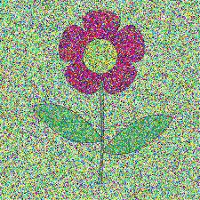

# Pixel Manipulation for Image Encryption

This project demonstrates an image encryption and decryption mechanism using pixel manipulation in Python. It utilizes the `Pillow` and `NumPy` libraries to manipulate images and adds encryption using noise generated with a pseudo-random key.

## Features

- **Encryption**: Adds noise to an image using bitwise XOR and saves the result as an encrypted image.
- **Decryption**: Removes the noise using the same key to retrieve the original image.
- **Key Management**: Saves and loads the encryption key for secure image processing.

## Requirements

- Python 3.7 or higher
- `Pillow` library
- `NumPy` library

Install the required libraries using pip:

```bash
pip install pillow numpy
```
## Usage   

**1.Encryption**:The encrypt_image function encrypts an image by adding noise to its pixels.  
```bash
encrypt_image(input_path, output_path, key_file)
```
  - input_path: Path to the input image file.
  - output_path: Path to save the encrypted image.
  - key_file: Path to save the encryption key.

**2.Decryption**:The decrypt_image function decrypts the image by removing the noise using the saved key.    
```bash
decrypt_image(input_path, output_path, key_file)
  ```
 - input_path: Path to the encrypted image file.  
 - output_path: Path to save the decrypted image.  
 - key_file: Path to the saved encryption key.  

## Key File  
The key file is saved in JSON format and contains the encryption key:
```bash
{
  "key": 12345
}
```
This key is critical for decrypting the image.    

## How It Works
- **Key Generation**: A random integer between 10 and 10,000 is generated as the key.  
- **Noise Creation**: The key seeds a pseudo-random number generator to create noise matching the dimensions of the image.  
- **Encryption**:Noise is added to the image pixels using bitwise XOR
- **Decryption**:The same noise is regenerated using the key, and bitwise XOR is applied again to retrieve the original image.

## File Structure  
|-- script.py             
|-- input_image.jpg       
|-- encrypted_image.jpg   
|-- decrypted_image.jpg   
|-- encryption_key.json     

## Notes  

- Ensure the same key is used for both encryption and decryption.  
- The process relies on the integrity of the key file; losing it will make decryption impossible.  

## Example
  


- **Encrytpted Image**:


     

- **Decrypted Image**:


    


